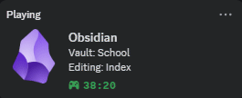

# Obsidian Discord Rich Presence
A plugin for Obsidian that displays your current activity as a rich presence status in Discord.

Features
* **Show Your Work**: Displays your current vault name and the file you're editing in your Discord status.
* **Highly Customizable**: Use placeholders to create custom status messages that fit your workflow.
* **Idle Detection**: Automatically shows you as "Idling" after a configurable period of inactivity.
* **Time Tracking**: Shows how long you've been working in your current session.
* **Privacy Mode**: Quickly toggle to a generic status to hide your specific activity.

## Installation
### From BRAT (Recommended for beta versions)
1. Install the Obsidian BRAT plugin.
2. Open the command palette (`Ctrl+P` or `Cmd+P`) and run the command `BRAT: Add a beta plugin for testing`.
3. Paste `Apoo711/obsidian-discordrpc` into the input field.
4. Click "Add Plugin". BRAT will now handle the installation and future updates.

### From GitHub Release (Manual)
1. Go to the Releases page of this repository.
2. Under the latest release, download the `main.js`, `manifest.json`, and `styles.css` files.
3. In your Obsidian vault, go to `Settings` > `Community plugins`.
4. Make sure "Restricted mode" is turned off.
5. Click the "folder" icon to open your vault's plugins folder (`YourVault/.obsidian/plugins/`).
6. Create a new folder named `new-discordrpc`.
7. Copy the downloaded `main.js`, `manifest.json`, and `styles.css` files into this new folder.
8. Return to Obsidian, go back to `Settings` > `Community plugins`, and click the "refresh" button.
9. Find "New Discord RPC" in the list and enable it.

## Configuration
The plugin's settings can be found in `Settings` > `Community Plugins` > `New Discord RPC`.

### Placeholders
You can use the following placeholders in the `Details`, `State`, and tooltip fields to customize the presence text:

- `{{vault}}`: The name of your current vault.

- `{{noteCount}}`: The total number of notes in the vault.

- `{{fileName}}`: The name of the file you are currently editing (without the extension).

- `{{fileExtension}}`: The extension of the file you are currently editing (e.g., `md`).

- `{{filePath}}`: The full path of the note within the vault.

- `{{folder}}`: The name of the parent folder.

- `{{creationDate}}`: The creation date of the current file.

- `{{wordCount}}`: The word count of the current file.

- `{{charCount}}`: The character count of the current file.

## Contributing
Contributions are welcome! If you have ideas for new features or have found a bug, please feel free to open an issue or submit a pull request.

## License
This plugin is licensed under the [MIT License](LICENSE).
